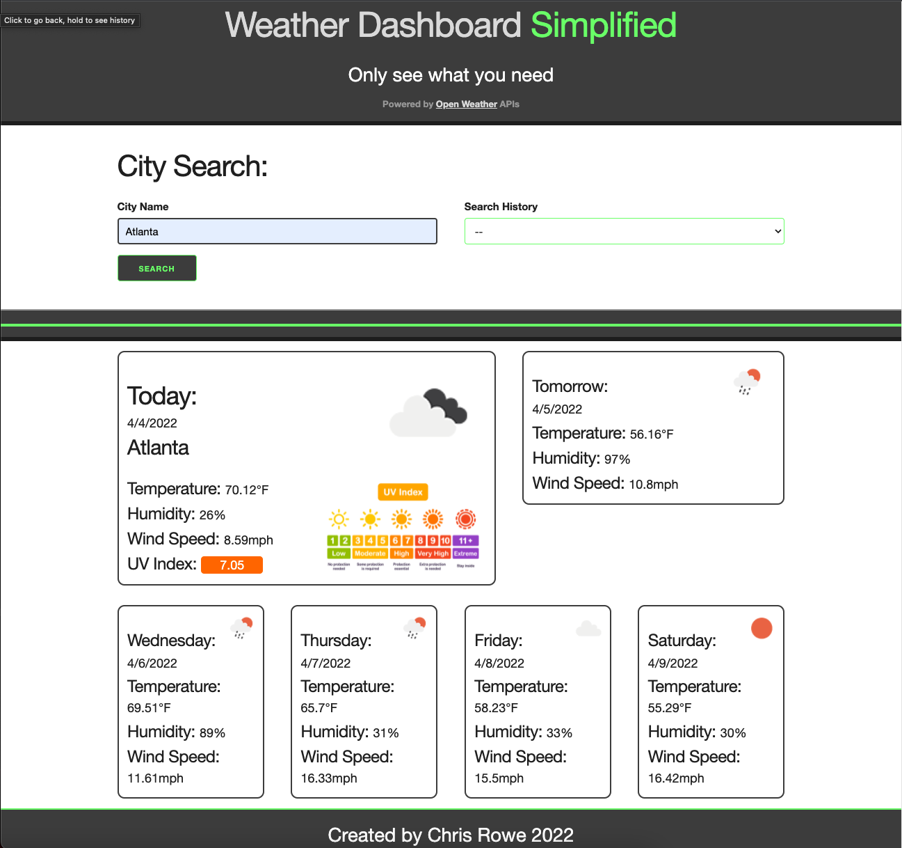

# Weather-Forecast
A simple weather dashboard showing the current weather as well as a 5 day forecast

## Installation

This is a browser application. Simply visit the launched page.  
[The live page with the web application](https://rowe2ry.github.io/Weather-Forecast/)

## Usage

This webb application really only has 1 way to interact. Type a city name into the search field and click the submit button. The application will remember your search history in a drop down menu. If you would like to repeat a previous search, click the drop down menu item you wish to search again. The page will populate with the information for the city.

## Credits
Open Weather API
Kevin Powell's "Conquering Responsive Layouts Page
Skelleton CSS framework

## License
[MIT](https://choosealicense.com/licenses/mit/)